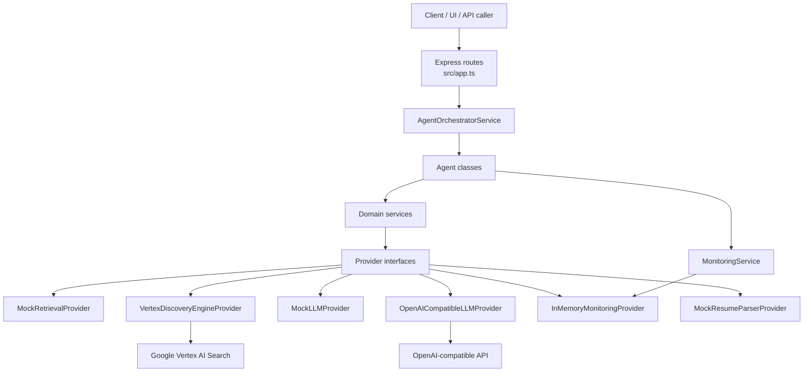

# Alivio Backend Architecture

This page explains how requests move through the backend, how providers are wired, and where to make changes safely.

## Quick orientation

- Runtime stack: Express + TypeScript.
- Composition root: `src/app.ts` wires providers, services, agents, and routes.
- Core pattern: provider interfaces + service layer + agent layer.
- Modes:
  - **Mock mode** (`APP_MODE=mock`) uses seeded data via `MockRetrievalProvider`.
  - **Live mode** (`APP_MODE=live`) uses `VertexDiscoveryEngineProvider` for retrieval.
- LLM behavior:
  - `OPENAI_API_KEY` configured: `OpenAICompatibleLLMProvider`.
  - Missing key: `MockLLMProvider`.

---

## Request flow (end-to-end)

1. HTTP request hits an endpoint in `src/app.ts` (for example, `/api/agents/matchready/run`).
2. Route handler maps payload to agent input and applies defaults where needed.
3. Route calls the corresponding agent on `AgentOrchestratorService`.
4. Agent starts a timer (`MonitoringService.startTimer()`), executes domain services, and logs outcome.
5. Services call provider interfaces (`RetrievalProvider`, `LLMProvider`, etc.).
6. Provider implementation is selected at app startup (mock vs live, mock LLM vs OpenAI-compatible).
7. Agent returns structured JSON output; Express returns it directly.
8. On error, agents that wrap work in `try/catch` log error runs and rethrow. Express currently returns default 500 responses for uncaught errors.

---

## Vertex retrieval flow

Used when `APP_MODE=live` and retrieval provider is `VertexDiscoveryEngineProvider`.

1. `CandidateSearchService` or `JobSearchService` calls `RetrievalProvider`.
2. `VertexDiscoveryEngineProvider.callSearch()`:
   - Gets Google access token via `google-auth-library`.
   - Builds Discovery Engine serving config path from env vars.
   - Builds search query string from role/specialty/geography/care setting.
   - Sends `POST` request to Discovery Engine `:search`.
3. If Vertex returns non-2xx:
   - Provider logs status/body.
   - Throws an error (`Vertex search failed: <status>`).
4. On success, documents are normalized into backend models:
   - Candidates via `normalizeCandidate(...)`.
   - Jobs via inline mapping in `searchJobs(...)`.
5. Downstream services receive normalized `Candidate[]` / `Job[]`.

---

## Normalization flow

Normalization happens in two places for two different goals:

### 1) Retrieval normalization (provider boundary)

- Vertex documents (`derivedStructData` / `structData`) are converted to internal `Candidate`/`Job` shapes.
- Missing fields get sensible defaults to keep downstream services stable.
- This isolates Discovery Engine field variability from the rest of the backend.

### 2) Candidate enrichment normalization (business cleanup)

- `EnrichmentService.enrich(...)` normalizes user-facing candidate fields:
  - Standardizes title aliases (example: `don` -> `Director of Nursing`).
  - Normalizes state abbreviations in location (`N.Y.` -> `NY`, `N.J.` -> `NJ`).
- Service computes missing fields + `completenessScore`.
- Service requests two short LLM suggestions for enrichment actions.

---

## Ranking flow

Ranking is performed by `MatchingService` + `FitScoringService`.

1. `MatchReadyAgent` calls `MatchingService.matchByJob(jobId)`.
2. `MatchingService` resolves target job through `JobSearchService`.
3. It fetches candidate pool using job-derived search criteria (role + geography).
4. `FitScoringService.scoreCandidateForJob(...)` computes factorized score:
   - title similarity
   - geography
   - license overlap
   - care setting
   - experience
   - keyword overlap
   - leadership
5. Weighted factors are combined into a 0–100 integer score.
6. Strengths (>=0.75 factor) and risks (<0.5 factor) are extracted.
7. Results are sorted descending by score before returning.

`SignalReadyAgent` reuses this same scoring path, then adds LLM narrative via `buildFitSignal(...)`.

---

## OpenAI generation flow

Generation entry points:

- `FitScoringService.buildFitSignal(...)` for fit explanation text.
- `EnrichmentService.enrich(...)` for enrichment suggestions.
- `OutreachService.generate(...)` for first-touch, follow-up, and call-prep content.

Provider flow:

1. Service calls `LLMProvider.generate(prompt, systemInstruction?)`.
2. `OpenAICompatibleLLMProvider` sends Chat Completions request:
   - model from `LLM_MODEL`
   - temperature `0.2`
   - system + user messages
3. Provider returns first message content, or empty string if missing.
4. If no API key exists, `MockLLMProvider` returns deterministic mock text.

---

## Error handling flow

### Current behavior

- Provider-level failures throw standard `Error` objects (example: Vertex non-2xx).
- `ScoutReadyAgent` and `MatchReadyAgent` use `try/catch` to:
  - log failed runs to `MonitoringService`
  - rethrow errors
- Other agents currently do not wrap errors; failures bubble directly to Express.
- Routes do not register a custom global error middleware, so Express default error handling applies.

### Operational implications

- Monitoring coverage for failures is strongest in Scout/Match paths.
- For consistent observability, consider standardizing error logging across all agents or adding centralized Express error middleware (future work).

---

## Recruiter request + webhook quick reference

- For a concise, recruiter-focused flow (request path, ranking, generation, webhook integration notes), see `backend/docs/recruiter-request-flow.md`.
- This backend currently exposes agent routes under `/api/agents/*` and does not register a dedicated `/api/webhook/*` route in `src/app.ts`.

---

## Module glossary (who owns what)

### Composition & runtime

- `src/app.ts`  
  Dependency wiring, provider selection, route registration, dashboard + metrics endpoints.
- `src/server.ts`  
  HTTP server bootstrap (`app.listen`).
- `src/config/env.ts`  
  Environment loading + typed config + mode flags.

### Agents (workflow entry points)

- `src/agents/agents.ts`
  - `ScoutReadyAgent`: candidate discovery + lead signals.
  - `MatchReadyAgent`: ranked matching for a job.
  - `EnrichReadyAgent`: candidate normalization + enrichment suggestions.
  - `SignalReadyAgent`: fit score + explanation signal.
  - `EngageReadyAgent`: outreach content generation.
  - `MonitorReadyAgent`: run summaries + logs.
  - `ParseResumeAgent`: resume parse -> enrich -> fit chain.

### Services (domain logic)

- `CandidateSearchService`: candidate retrieval + dedupe by name/location.
- `JobSearchService`: job retrieval passthrough.
- `MatchingService`: coordinates job lookup, candidate retrieval, scoring, sorting.
- `FitScoringService`: deterministic scoring + LLM fit explanation.
- `EnrichmentService`: data normalization, missing-field detection, enrichment suggestions.
- `OutreachService`: multi-message outreach generation.
- `ResumeParsingService`: parser provider wrapper.
- `MonitoringService`: timing/logging facade + summary retrieval.
- `AgentOrchestratorService`: typed holder for agent instances.

### Providers (integration boundary)

- `RetrievalProvider` interface:
  - `MockRetrievalProvider`: seeded in-memory filters.
  - `VertexDiscoveryEngineProvider`: live Discovery Engine search + normalization.
- `LLMProvider` interface:
  - `OpenAICompatibleLLMProvider`: real chat completions.
  - `MockLLMProvider`: deterministic local mock.
- `MonitoringProvider` interface:
  - `InMemoryMonitoringProvider`: transient runtime logs/summaries.
- `ResumeParserProvider` interface:
  - `MockResumeParserProvider`: heuristic parser implementation.

---

## Lightweight architecture diagram

---

## Contributor notes

- Prefer adding new integrations behind existing provider interfaces.
- Keep deterministic business scoring in services; use LLM only for narrative/suggestions.
- Add monitoring logs near agent boundaries to keep run-level observability consistent.
